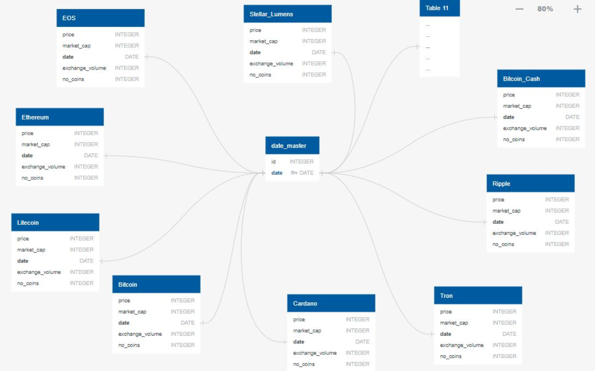

# ETL_Project - Cryptocurrencies

**Cryptocurrency is an internet-based medium of exchange which uses cryptographical functions to conduct financial transactions. Cryptocurrencies leverage blockchain technology to gain decentralization, transparency, and immutability.
Cryptocurrencies can be sent directly between two parties via the use of private and public keys.  These transfers can be done with minimal processing fees, allowing users to avoid the steep fees charged by traditional financial institutions**

# Project Scope

To extract available trading data on Top 10 Cryptocurrencies from two different scources, perform data wrangling, merge the datasets. Load into the Database and create Tables for each Cryptocurrency. 
Time Frame : 07-01-2017 to 06-30-2019
Main Goal is to provide a user Datasets on Individual Currency such that any comparisons could be made between currencies for further analysis.

Top 10 currencies identified by Market Trend
- Ethereum (ETH)
- Litecoin (LTC)
- Bitcoin (BTC)
- Stellar Lumens(XLM)
- EOS (EOS)
- Cardano (ADA)
- Tron (TRX)
- Bitcoin Cash (BCH)
- Binance Coin (BNB)
- NEO (NEO)

# Data Sources
https://www.cryptocompare.com/

https://coinmetrics.io/

# Data Extraction and Transformation

1. Accessed data from Cryptocompare through API and retrieved  
   https://min-api.cryptocompare.com/documentation?key=Historical&cat=dataSymbolHistoday
    - Exchange Volume and
    - Pricing
2. Downloaded Data on all 10 Currencies from coinmetrics as individual csv. Data Exploratory Analysis involves 
    - Reviewing available data
    - Dropping NA's and not required columns
    - Eliminating rows with date range < 07-01-2017 and > 06-30-2019
    - Using Market Cap and Price to compute Market Supply 
    - Market Supply(No.of coins) = Market Cap in USD / Price in USD 
3. Merge the cleaned files with data from CryptoCompare

# Data Loading 

1. Postgress database is selected since an open-source relational database was preferred
2. Created Tables for each cryptocurreny and Master tables by Price and Exchange Volume
3. Created a Table for DateTime Id to reference within each of the cryptocurrency table
4. Tested the Table contents using sql query
5. Merged contents of Data retrieved from Crypto Compare and Coinmetrics

select total_ex_vol."BCH" as "Exchange Volume", final_price."BCH" as "Price (USD)", bch."Date", bch."Market Cap (USD)", bch."Number of Coins"
from total_ex_vol
join final_price on total_ex_vol."Date" = final_price."Date"
join bch on final_price."Date" = bch."Date";

# ERD Diagram

# Table of Contents (Steps to Follow)
- Open the Code Folder 
-- CryptoCompare -> execute Price_API & Exchange_Vol_API jupyter notebook
-- Jupyter Notebooks -> execute all the files
- Run the Schema.sql and SQL_query.sql files

# Challenges 
1. Understanding the concept of 'Digital Currency' and how they function & some financial key terminologies
2. Deciding between MongoDb or Postgres
3. Finding the common key between the two data sources since most data was textual based. Hence, we had to use Date and since the
   formats were different in each resource, we created a DateID Field
4. Identifying Data type for Market Cap, Price since we tried Float and Double, but until we used Double Precision, importing the csv's 
   was not working
   
# Team Members 
## Melissa Mason, Emi Babu, Dan Dragone & Malini Murthy

 

